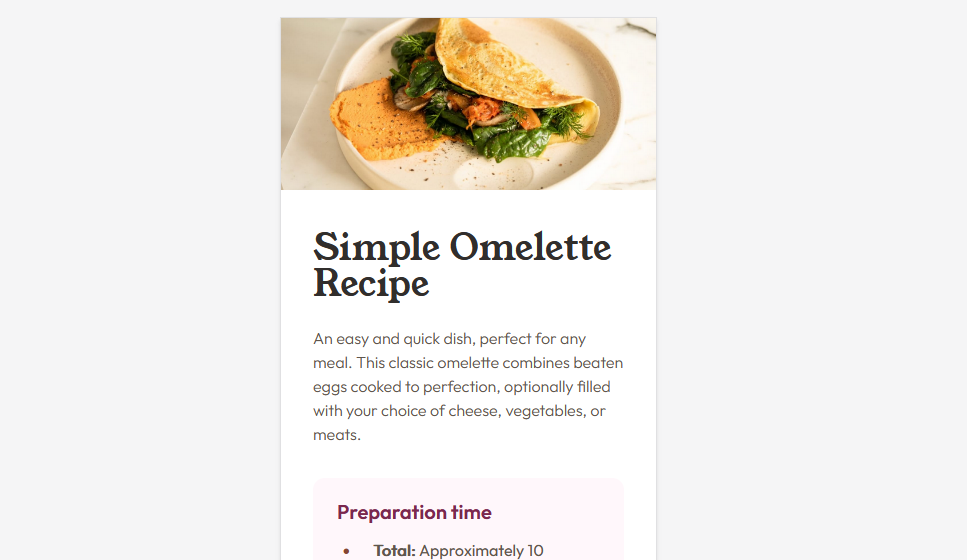
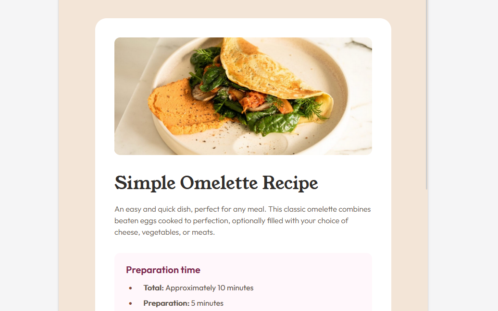

# Frontend Mentor - Recipe page solution

This is a solution to the [Recipe page challenge on Frontend Mentor](https://www.frontendmentor.io/challenges/recipe-page-KiTsR8QQKm). Frontend Mentor challenges help you improve your coding skills by building realistic projects. 

## Table of contents

- [Overview](#overview)
  - [The challenge](#the-challenge)
  - [Screenshot](#screenshot)
  - [Links](#links)
- [My process](#my-process)
  - [Built with](#built-with)
  - [What I learned](#what-i-learned)
  - [Continued development](#continued-development)
- [Author](#author)

## Overview

### Screenshot

Mobile View:

Tablet View:

### Links

- Solution URL: [Solution Page](https://www.frontendmentor.io/solutions/recipe-page-7HpREVNEdq)
- Live Site URL: [Github Pages](https://dasaru.github.io/recipe-page/)

## My process

### Built with

- Semantic HTML5 markup
- CSS custom properties
- Flexbox
- Mobile-first workflow

### What I learned

The biggest thing that I learned with this project is that vertical margins do not collapse when using flexbox and CSS grid. I will have to keep this in mind in my future projects. Additionally, I learned to use relative paths instead of absolute paths when linking my fonts. Otherwise it will use the absolute path of where my page is hosted on github rather than search from my project itself.

### Continued development

In this project I have used BEM (block-element-modifier) methodology. It seems to be pretty good at organizing my CSS into smaller chunks that are easier to maintain. So I I'll continue to use it in the future.

## Author

- Frontend Mentor - [@Dasaru](https://www.frontendmentor.io/profile/Dasaru)
